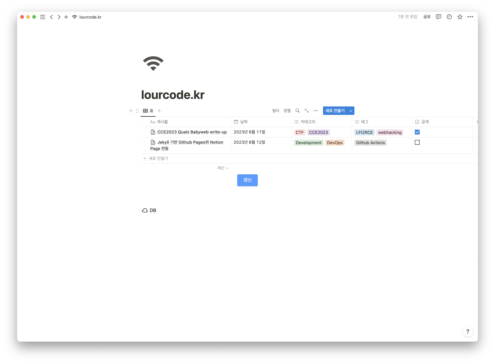
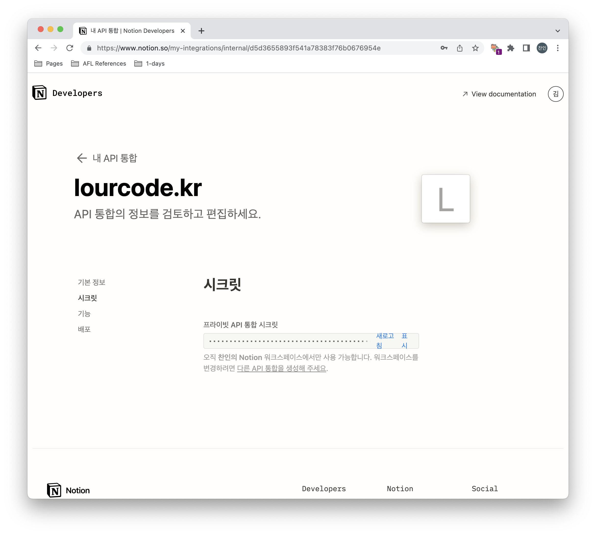
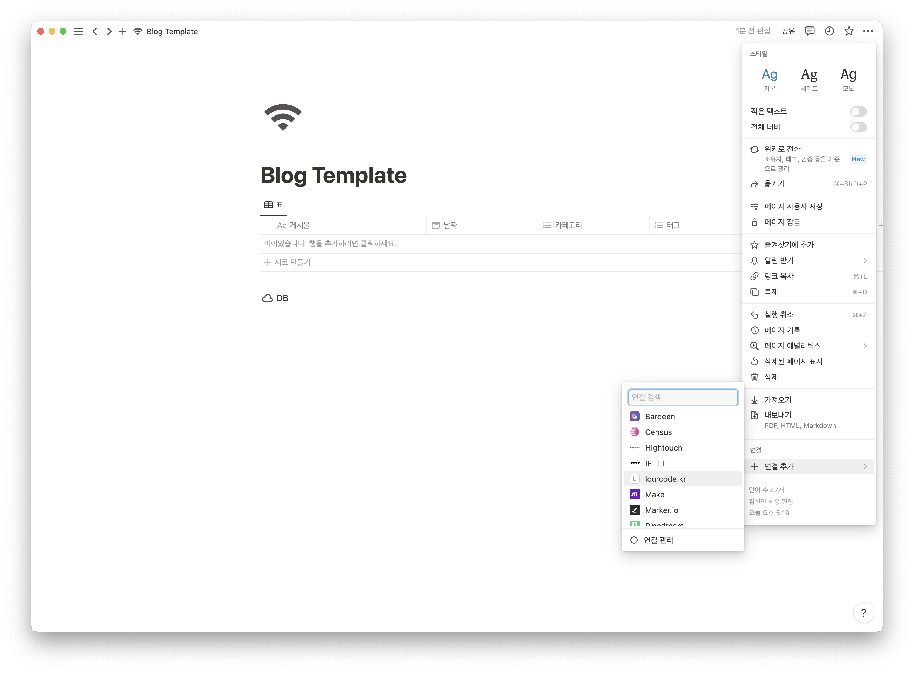
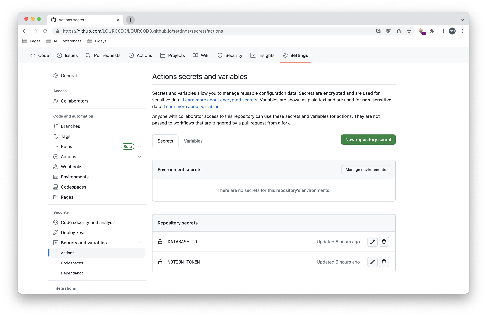
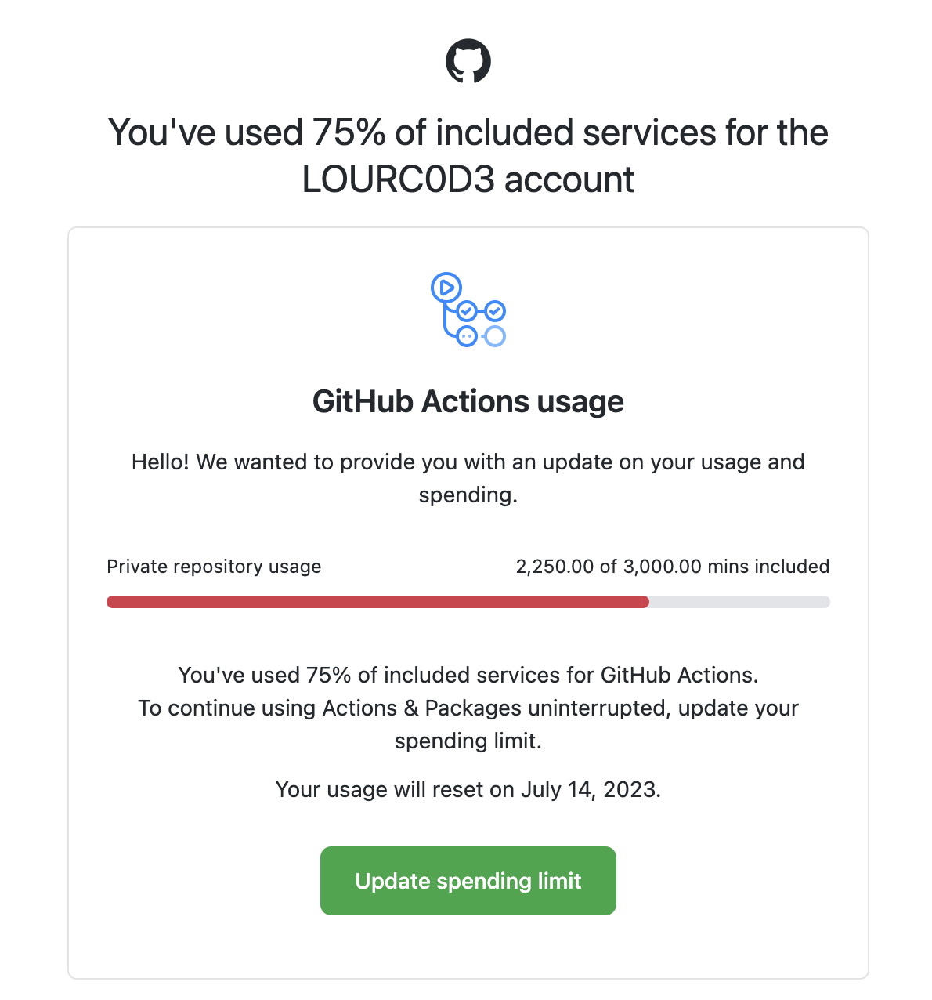

import Callout from '@/components/callout.astro'
import GistEmbed from '@/components/gist-embed.astro'


<Callout variant="note">

For the English version of this post, see [here](https://lourcode.kr/posts/Integrating-Jekyll-based-Github-pages-with-Notion-pages/).

</Callout>

## 개요


최근에 Notion과 Next.js를 연동하여 Notion Page를 자동으로 import 해주는 블로그 템플릿을 제공하는 흥미로운 [Repository](https://github.com/morethanmin/morethan-log)를 발견하였다. 


다만, 지금 블로그가 내가 선호하던 디자인에 더 가까웠기에 지금 블로그에 해당 기능을 추가하기로 결정했다.


평소에는 Notion에 작성한 후에 Markdown으로 뽑고 살짝 수정을 거쳐서 블로그에 업로드 했었는데, 지금은 Notion에 작성만 하면 알아서 블로그에 업로드 되서 아주 간편하다.


<br />


기존에 Jekyll과 Notion을 연동한 내용을 담은 블로그 글이 있길래 해당 [블로그](https://aymanbagabas.com/blog/2022/03/29/import-notion-pages-to-jekyll.html)를 참고해서 개발하였다.


<br />


완성본은 다음과 같다.





갱신 버튼을 눌러주는 것만으로 블로그에 글이 자동으로 등록된다.


<br />


이제 구현 방법에 대해 알아보자!


## Notion 환경 설정


먼저, Notion에서 API 통합을 생성해주어야 한다.


아래의 링크에서 새 API 통합을 생성해준 후에 Secret 값을 안전한 곳에 보관한다.


[https://www.notion.so/my-integrations](https://www.notion.so/my-integrations)





다음으로는 블로그 게시물을 작성할 페이지를 생성한다. 아래 템플릿을 사용하면 된다.


[블로그 템플릿](https://lourcode.notion.site/Blog-Template-d6d587e11ac04f2abcdba4412dae5387)


<br />


다음과 같이 생성했던 API 통합을 페이지에 추가해준다.





다음으로는 데이터베이스에 대한 ID를 알아야한다. 페이지 링크를 복사하면 데이터베이스 아이디를 구할 수 있다.


DB 페이지로 이동한 후 링크 복사를 눌러주면 아래와 같이 생긴 링크를 얻을 수 있다.


`https://www.notion.so/<database_id>?v=<long_hash>`


여기서 `database_id`를 안전한 곳에 보관해준다.


<br />


이제 Notion에서 해야 할 일은 모두 끝났다.


## Github 환경 설정


먼저 환경 변수를 등록해주어야 한다. 아까 복사해둔 토큰들을 등록해주면 된다.


Key명은 다음과 같이 설정한다.





<br />


다음으로, workflow 파일과 Notion page 내용을 읽어오는 스크립트 총 두개를 추가해줘야 한다.


<br />


먼저, 스크립트 파일이다.


`_scripts/notion-import.js`


<GistEmbed id="LOURC0D3/17792881fa7d8a49ffea566b5a17ea8f" />


<br />


위 Javascript 파일에 대한 dependencies를 설치해준다.


`package.json` 위치에 생성하면 된다.


```json
{
    "devDependencies": {
        "@notionhq/client": "^1.0.4",
        "@types/node-fetch": "^2.6.2",
        "moment": "^2.29.2",
        "node-fetch": "^2.6.7",
        "notion-to-md": "^2.5.5",
        "axios": "^1.4.0"
    }
}
```


<br />


다음은 workflow 파일이다.


배포 파일은 템플릿마다 다르므로 약간의 수정이 필요할 수 있다.


`.github/workflows/pages-deploy.yml`


```yaml
name: "Build and Deploy"
on:
  repository_dispatch:
    types: [RUN_WORKFLOW_DISPATCH]
      
permissions:
  contents: write
  pages: write
  id-token: write

# Allow one concurrent deployment
concurrency:
  group: "pages"
  cancel-in-progress: true

jobs:
  importer:
    runs-on: ubuntu-latest

    steps:
      - uses: actions/checkout@master
    
      - name: Clean Directory
        run: |
          for file in assets/img/*
          do
              if [[ $file != "assets/img/favicons" ]]
              then
                  rm -rf "$file"
              fi
          done
          rm -rf _posts/*
      
      - uses: actions/setup-node@v3
        with:
          node-version: "17"

      - run: npm install

      - run: node _scripts/notion-import.js
        env:
          NOTION_TOKEN: ${{ secrets.NOTION_TOKEN }}
          DATABASE_ID: ${{ secrets.DATABASE_ID }}

      - uses: stefanzweifel/git-auto-commit-action@v4
        env:
          GITHUB_TOKEN: ${{ secrets.GITHUB_TOKEN }}
        with:
          commit_message: "[배포] Notion 변경 사항 저장"
          branch: main
          commit_user_name: importer-bot 🤖
          commit_user_email: actions@github.com
          commit_author: importer-bot 🤖 <actions@github.com>
 
  build:
    needs: importer
    runs-on: ubuntu-latest

    steps:           
      - name: Checkout
        uses: actions/checkout@v3
        with:
          ref: main
          fetch-depth: 1
          # submodules: true
          # If using the 'assets' git submodule from Chirpy Starter, uncomment above
          # (See: https://github.com/cotes2020/chirpy-starter/tree/main/assets)

      - name: Setup Pages
        id: pages
        uses: actions/configure-pages@v1

      - name: Setup Ruby
        uses: ruby/setup-ruby@v1
        with:
          ruby-version: '3.1' # reads from a '.ruby-version' or '.tools-version' file if 'ruby-version' is omitted
          bundler-cache: true

      - name: Build site
        run: bundle exec jekyll b -d "_site${{ steps.pages.outputs.base_path }}"
        env:
          JEKYLL_ENV: "production"

      - name: Test site
        run: |
          bundle exec htmlproofer _site --disable-external --check-html --allow_hash_href

      - name: Upload site artifact
        uses: actions/upload-pages-artifact@v1
        with:
          path: "_site${{ steps.pages.outputs.base_path }}"

  deploy:
    environment:
      name: github-pages
      url: ${{ steps.deployment.outputs.page_url }}
    runs-on: ubuntu-latest
    needs: build
    steps:
      - name: Deploy to GitHub Pages
        id: deployment
        uses: actions/deploy-pages@v1
```


## 갱신 버튼 설정


블로그 글이 업데이트 되는 조건은 다음과 같다.

- disptach를 통해 워크플로우가 트리거 되었을 때

<br />


dispatch를 이용하면 버튼을 눌러서 게시글 업데이트를 진행할 수 있다.


<br />


먼저, Github AccessToken을 생성해주어야 한다.


`Settings`→`Developer settings`→`Personal access tokens`로 들어가서 새 토큰을 생성해준다.


scope는 `repo`, `workflow`, `admin:repo_hook`를 선택해준다.


이제 토큰을 안전한 곳에 복사해둔다.


<br />


Notion은 페이지를 임베딩 시킬 수 있으므로 웹 페이지를 통해 POST 메세지를 전송시킬 수 있다.


이러한 방법을 이용하여 dispatch를 실행시킬 수 있도록 구현했다.


아래 링크를 이용하면 HTML 코드를 GET 방식으로 전달할 수 있으므로 토큰 유출에 대한 걱정이 없다.


다만 확인해본 결과 로그를 수집하는 것 같아 새로 fork하여 관련 코드를 모두 삭제 하였다.


아래 링크에서 html 코드를 생성하고 그 아래 링크로 노션에 추가하면 된다.

- [https://lourcode.kr/notion-tools-embeds/make/html/index.html](https://lourcode.kr/notion-tools-embeds/make/html/index.html)

<br />


다음과 같이 코드에서 `USERNAME`, `REPO_NAME`, `GITHUB_ACCESS_TOKEN`을 변경한 후 링크를 생성한다.


`ACCESS_TOKEN`은 위에서 생성한 토큰을 작성하면 된다.


```html
<!DOCTYPE html>
<html>
<head>
  <meta charset="UTF-8">
  <style>
    .trigger-container {
      display: flex;
      flex-direction: column;
      align-items: center;
      text-align: center;
    }

    .trigger-button {
      display: inline-block;
      margin-bottom: 10px;
      padding: 10px 20px;
      background-color: #4c9aff;
      color: white;
      font-size: 16px;
      border: none;
      cursor: pointer;
      border-radius: 4px;
      box-shadow: 0px 2px 6px rgba(0, 0, 0, 0.1);
      transition: background-color 0.3s;
    }

    .trigger-button:hover {
      background-color: #2e86ff;
    }

    .message {
      font-size: 16px;
      color: #333;
    }
  </style>
</head>
<body>
  <div class="trigger-container">
    <button id="triggerButton" class="trigger-button">갱신</button>
    <div id="message" class="message"></div>
  </div>

  <script>
  document.getElementById("triggerButton").addEventListener("click", function() {
    var messageElement = document.getElementById("message");
    messageElement.textContent = "요청 전송 중...";

    var xhr = new XMLHttpRequest();
    xhr.open("POST", "https://api.github.com/repos/USERNAME/REPO_NAME/dispatches", true);
    xhr.setRequestHeader("Accept", "application/vnd.github.v3+json");
    xhr.setRequestHeader("Authorization", "Bearer GITHUB_ACCESS_TOKEN");
    xhr.setRequestHeader("Content-Type", "application/json");

    xhr.onload = function() {
      if (xhr.status === 204) {
        messageElement.textContent = "요청이 성공적으로 전송되었습니다." + xhr.status;
      } else {
        messageElement.textContent = "요청 전송에 실패했습니다.<br>상태 코드: " + xhr.status;
      }
    };

    xhr.onerror = function() {
      messageElement.textContent = "요청 전송 중 알 수 없는 오류가 발생했습니다.";
    };

    xhr.send(JSON.stringify({"event_type": "RUN_WORKFLOW_DISPATCH"}));
  });
</script>
</body>
</html>
```


<br />


이제 Notion 페이지에서 임베드를 통해 해당 링크를 연결한다.


여기까지 완료되면 버튼을 통해 블로그가 업데이트 되는 것을 확인할 수 있다!


## cron scheduler를 사용하지 않는 이유


원래는 업데이트 버튼과 cron scheduler를 이용하여 게시글 업데이트를 진행하였는데, 어느날 이런 메일이 도착했다.





우리는 게시글이 업데이트 될 때가 언제인지 알고 있기 때문에 cron scheduler가 필요없다고 판단하여 기능을 deprecation 하였다.


## 마무리


Github Actions를 이용하여 Notion과 Github pages를 통합해보았다.


Actions는 항상 많이 헷갈려서 오랜 시간 삽질하게 되는거 같다.


<br />


블로그 구축과 관련된 모든 코드는 아래 [여기](https://github.com/LOURC0D3/Jekyll-with-Notion-Template/tree/main)에 올려두었습니다.


또는 이 [링크](https://github.com/LOURC0D3/chirpy-starter-jekyll-with-notion/generate)를 통해 초기 세팅이 완료된 레포지토리 템플릿을 이용하실 수 있습니다.


## 레퍼런스

- https://aymanbagabas.com/blog/2022/03/29/import-notion-pages-to-jekyll.html

## 업데이트 기록

- 이미지 업로드 문제 개선
- 1차 코드 블럭 이슈 개선
- 2024.05.07 2차 코드 블럭 이슈 개선
- 2024.05.07 Pagination 기능 통합
