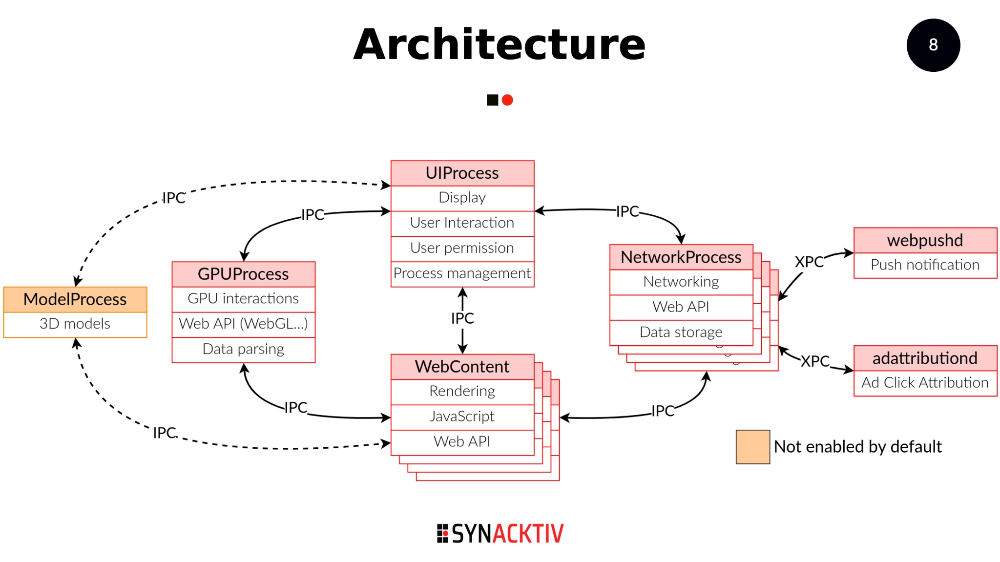
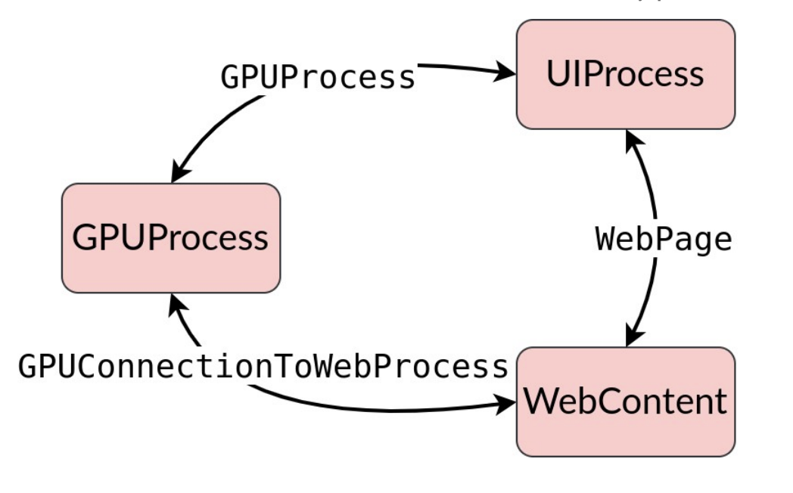
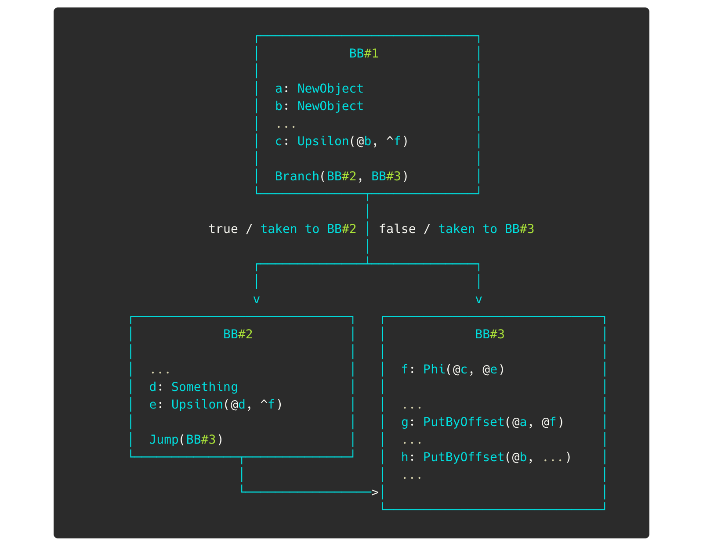
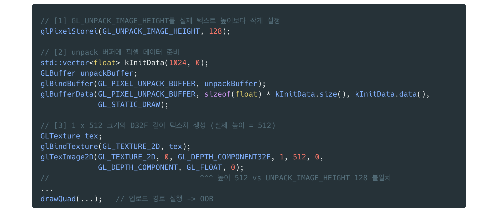
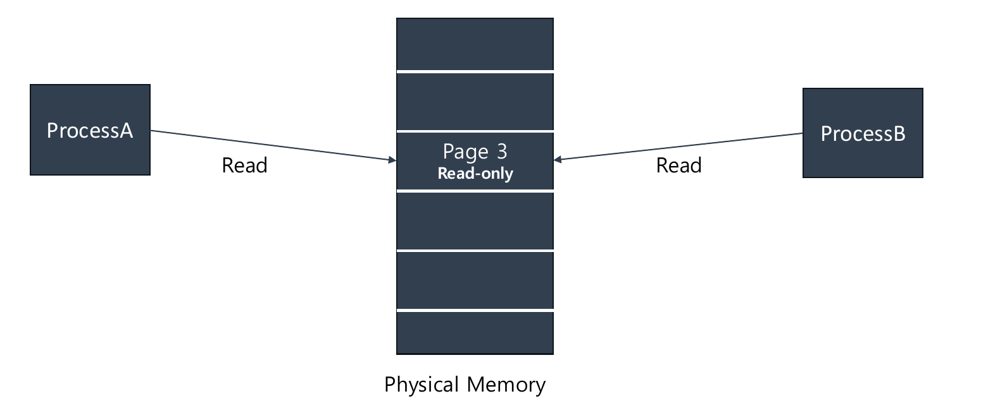
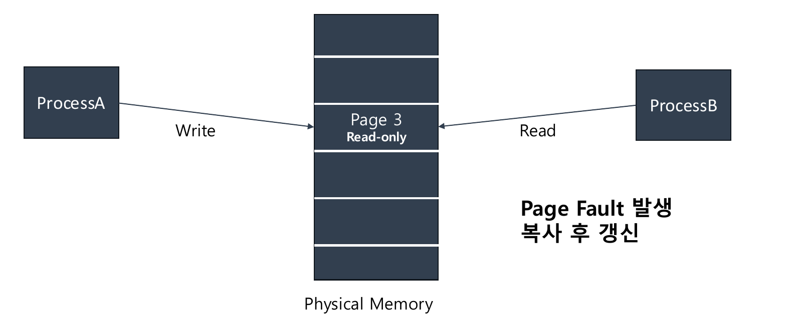
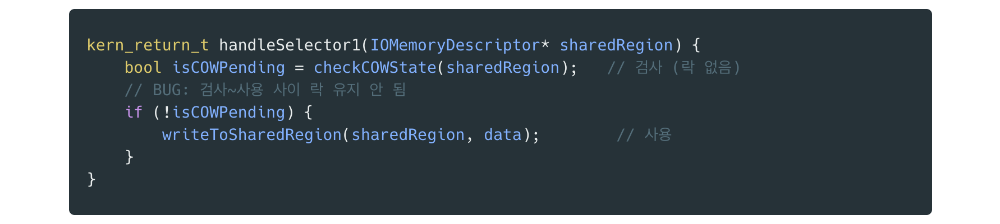
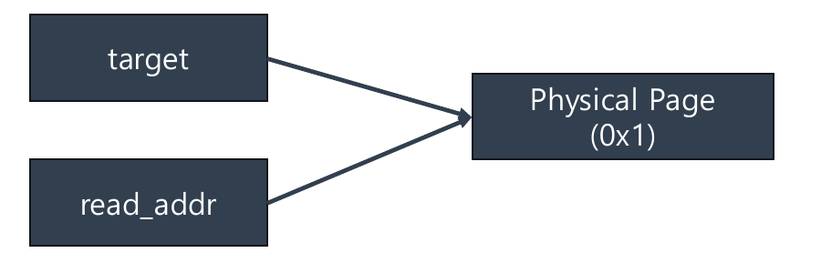
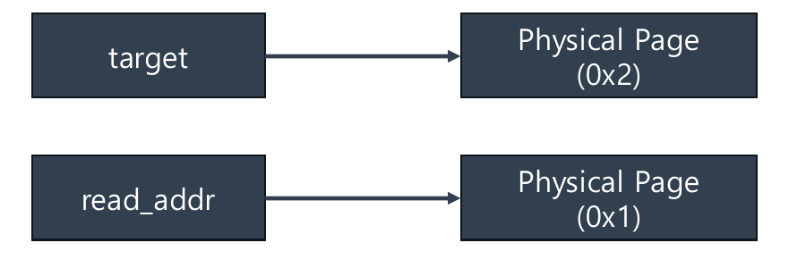
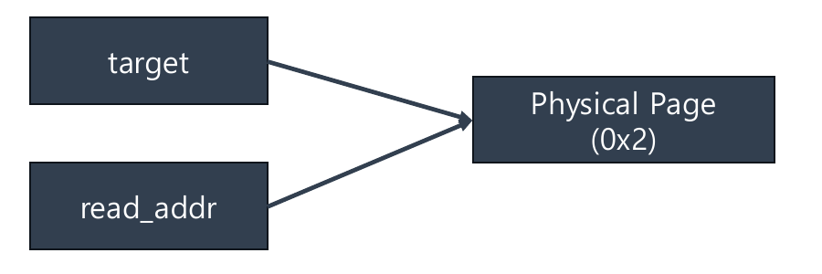

import Callout from '@/components/callout.astro'


<Callout variant="note">


This post was written by converting the PPT of an internal seminar presentation from a school club using an LLM.


</Callout>


## Introduction


In March 2026, Google’s Threat Intelligence Group (GTIG) disclosed multiple zero-day iOS exploit chains used by threat actors believed to be state-sponsored. Since at least November 2025, these exploits had been deployed across separate campaigns targeting Saudi Arabia, Turkey, Malaysia, and Ukraine.


This post analyzes one of them — the Safari full chain known as **DarkSword**. Its impact is simple, but devastating.

> **Simply visiting a specific link is enough to fully compromise an iPhone.**

The full chain is composed of six distinct vulnerabilities, and this post walks through the Root Cause Analysis (RCA) and exploitation of each one.


---


## Background: Safari’s Multi-Process Architecture


Safari (WebKit) is not a single monolithic process; it is composed of **multiple processes separated by role**. Each process runs at a different privilege level and is isolated inside a Sandbox.

- **Renderer Process (WebContent)** — Handles HTML/JS/CSS rendering. The weakest-privileged (Sandboxed) process.
- **Privileged Process** — A medium-privileged (Sandboxed) process granted some capabilities for a specific purpose (GPU, Network, etc.).
- **OS Process / Kernel** — The strongly-privileged region outside the Safari Sandbox boundary.

*Safari is split into WebContent (Renderer), GPUProcess, NetworkProcess, UIProcess, and others; each process communicates via Mach-XPC-based IPC.*


The processes are isolated from one another and communicate only through **IPC built on Mach XPC**. This structure is exactly what determines the difficulty of an attack.

- Even after obtaining an RCE primitive in the Renderer process, the Sandbox limits you to restricted privileges.
- Therefore, you must use the Renderer’s privileges to **obtain another RCE primitive in a different process (Sandbox Escape)**.
- In other words, an RCE primitive inside Safari alone does not equal full iOS RCE. **Only after completing the Sandbox Escape do you finally break out of every Sandbox.**

*Even with RCE inside the renderer, crossing the sandbox boundary requires compromising a higher-privileged process over IPC.*


---


## Exploit Chain Overview


The DarkSword chain flows through renderer compromise → mitigation bypass → sandbox escape → GPU escape → kernel privilege escalation, weaving six vulnerabilities together.


| Stage          | Role                          | CVE                                     |
| -------------- | ----------------------------- | --------------------------------------- |
| ① Renderer RCE | JavaScriptCore exploit        | **CVE-2025-31277** / **CVE-2025-43529** |
| ② PAC Bypass   | Pointer authentication bypass | **CVE-2026-20700**                      |
| ③ Renderer SBX | Renderer sandbox escape       | **CVE-2025-14174**                      |
| ④ GPU SBX      | GPU process sandbox escape    | **CVE-2025-43510**                      |
| ⑤ LPE          | Kernel privilege escalation   | **CVE-2025-43520**                      |


_Starting from two JavaScriptCore RCEs (CVE-2025-31277 / CVE-2025-43529), the chain links PAC Bypass → Renderer SBX → GPU SBX → LPE in sequence._


---


## Exploit #1 — Renderer Exploit (JavaScriptCore)


The chain begins with RCE in the JavaScript engine, JavaScriptCore (JSC). The talk covers two vulnerabilities.

- **CVE-2025-31277** — JavaScriptCore JIT Type Confusion _(patched in iOS 18.6)_
- **CVE-2025-43529** — JavaScriptCore JIT DFG GC Bug to UAF _(patched in iOS 18.7.3, 26.2)_

This post focuses on **CVE-2025-43529**, which is the more interesting of the two because it is deeply entangled with how the GC works. In one line:

> A Use-After-Free caused by a missing StoreBarrier insertion for Upsilon nodes in the DFG JIT’s `StoreBarrierInsertionPhase`.

### Background — JIT & GC


Two pieces of prerequisite knowledge are needed to understand this bug.

- **JIT (Just-In-Time) Compiler** — Translates bytecode into machine code at runtime to boost execution speed.
- **GC (Garbage Collection)** — JavaScript allocates and frees objects automatically, releasing an object once it is no longer used.

Generational GC


JSC uses a Generational GC that partitions memory based on the **age** of objects.

- Memory is divided into **new space (Eden)** and **old space**.
- Every object starts in Eden; when Eden fills up, an **Eden GC** runs. → Surviving objects are **promoted** to old space.
- Cleanup of old-space objects is done through a **full GC**.

Here a crucial exception arises.

> **Exception: If an Old object points to an Eden object, an Eden-only scan cannot discover that reference.**

From the perspective of a lightweight GC that only scans Eden, an object in old space referencing an Eden object goes unnoticed — so it may judge the Eden object as “used by no one” and free it. When that happens, the old object is left holding a dangling pointer to already-freed memory.


StoreBarrier


The mechanism that prevents this is the **StoreBarrier**. The moment a new old→eden reference is created, it tells the GC _“please remember this reference,”_ storing it in the **remembered set**. Because the Eden GC also checks the remembered set, an Eden object referenced by an old object is never mistakenly freed.


cellState — Tri-color Marking


To drive the Generational GC, every object encodes its state through a 1-byte `cellState` (a color tag).

- **White(1)** — An object freshly allocated in Eden. If it stays unmarked through a GC cycle, it is collected.
- **Black(0)** — An object whose marking is complete or in progress. **Treated as a live object.**
- **Grey(2)** — An object that needs scanning. Its references have changed, so a GC scan is required.
> **Core rule: A Black object must not point to a White object.**
>
> The GC assumes a Black object “needs no scanning” and does not inspect the White objects it points to. → As a result, a White object that is still alive can end up freed.
>
>

Concurrent GC


On top of this comes the **Concurrent GC**. While the application runs, a background GC Thread reclaims memory (marking) concurrently with the Main Thread. Because marking and application code run in parallel, there is a dangerous window in which a new White reference gets attached to an already-marked (Black) object. The StoreBarrier defends precisely this moment — by coloring the referenced object Grey and storing it in the remembered set.


Visually, it looks like this. Without a StoreBarrier, `Obj1st` in Old Space points to the still-alive Eden object `Obj2nd`, yet the GC (the garbage truck) collects `Obj2nd` without knowing.


A Black object points to a White object, but the GC does not inspect it — so the live White object (Obj2nd) is freed, producing a Use-After-Free.


When the StoreBarrier works correctly, the moment an old→eden reference is created it colors the target Grey — signaling _“I’m still using this, please remember it”_ to the Marking Thread — and stores it in the remembered set.


Once the StoreBarrier marks `Obj2nd` Grey and registers it in the remembered set, the GC recognizes the object as alive and does not collect it.


In short, **only when the StoreBarrier is inserted correctly is an old→eden (or Black→White) reference safely remembered by the GC.** The essence of this bug is that this barrier goes missing.


### Background — The Three Tiers of DFG JIT


JSC’s JIT consists of three tiers in total.

- **Tier 1: Baseline JIT** — Generates native code quickly with low compilation overhead.
- **Tier 2: DFG JIT** — Serious optimization begins after Baseline. Uses collected type information to speculate and eliminate unnecessary operations.
- **Tier 3: FTL JIT** — Top-tier optimization.

The bug occurs during optimization in Tier 2, the **DFG JIT**.


### The Bug — The Vanished StoreBarrier


During DFG optimization, the **`StoreBarrierInsertionPhase`** is responsible for inserting a StoreBarrier after write nodes such as `PutByOffset`. In this vulnerability, however, **the StoreBarrier that should be inserted is not inserted.**


The heart of the problem lies in the DFG IR’s **Phi / Upsilon nodes**.

- **Upsilon node** — A node that marks, in each basic block (BB), the value to be used by a Phi.
- **Phi node** — A node that selects one of several value definitions at a control-flow merge point. The final value is determined by which BB execution arrived from.

*BB#1 creates objects a and b and branches to BB#2 / BB#3. In BB#3, f: Phi(@c, @e) can be b or d depending on the path taken, and is stored into the old object a via g: PutByOffset(@a, @f).*


Walking through the code flow:

- `A.p0` can be `b`, and `b.p0` can be `a`, forming the graph `A -> b -> a`. That is, if `A` is a live object, then `b` and `a` must be alive too.
- In the first `PutByOffset -> A.p0 = f`, the old-space object `A` comes to point to the new object `f`. **Since** **`f`** **is reachable through** **`A`****, a StoreBarrier must be inserted.**
- But `f` is a **Phi node**. Meaning that `b` and `d` — connected via Upsilon and eligible to become `f` — are effectively stored into `A` as well.

And this is exactly where the bug detonates.

> **Bug: The objects of Upsilon nodes connected to a Phi node are not handled.**
>
> The Phi itself has a StoreBarrier, but `b` and `d` connected through the Phi are marked as objects the GC needn’t scan, so StoreBarrier insertion is skipped. → The GC has no idea that `b` or `d` point to `a`.
>
>

This leads to a Use-After-Free through the following scenario:

1. The Marking thread marks `A` and `b` as **Black**.
2. The Main thread executes `b.p0 = a`. At this point `a` is a not-yet-marked Eden object, so it is **White**.
3. Because there is no StoreBarrier, the GC does not know `b` points to `a`. → It judges `a` to have no other referencing path and **frees** it.
4. Later, reading `b.p0` accesses the freed `a`, triggering a **Use-After-Free**.

Building an arbitrary read/write primitive inside JSC on top of this UAF completes **RCE** within the renderer process.


---


## Exploit #2 — PAC Bypass (CVE-2026-20700)


Code execution inside the renderer is now possible, but Apple’s powerful mitigation **PAC (Pointer Authentication Code)** blocks arbitrary code execution. The next piece of the chain is bypassing this PAC.

> An attacker holding an AAR/AAW (arbitrary read/write) primitive tampers with transient loader state on the stack, hijacking dyld’s notify path to bypass PAC verification.

### Background — PAC


PAC is a mitigation introduced to prevent an attacker from arbitrarily modifying pointers.

- It embeds an **encrypted signature** into the unused upper bits of a pointer.
- It then verifies the signature when the pointer is later used.
- Apple uses an ARM PAC implementation + a custom version. **Usermode PAC is performed in dyld, Kernelmode PAC in the Kernel.**

Since an attacker cannot generate a valid signature even after tampering with a pointer to an arbitrary address, arbitrary code execution is blocked. The attacker’s goal is therefore:

> **PAC Bypass: an exploit that forges a pointer to appear legitimately signed in order to execute arbitrary code.**

### Background — dyld & Loader*


Apple manages shared libraries requiring dynamic linking through **dyld (dynamic linker/loader)** — a role similar to Linux’s PLT/GOT. dyld loads shared libraries into memory at the binary’s entry point and then links them, **performing PAC signing during this process.**


The flow of a runtime library load (`dlopen`) is as follows:

1. Load the requested library into memory.
2. Manage the library as a **`Loader*`** **object** (containing the library path, dependencies, initializer function addresses, etc.).
3. Call the library’s constructor functions.
4. Signal load completion via the **Notifier**.

The key insight here is this:

> **What if the** **`Loader*`** **object is forged? → A valid PAC signature can be produced.**

### Background — Protection Mechanisms


Apple is aware of this risk too, so dyld keeps its internal control data **locked read-only and unlocks it only when needed**. There are two write mechanisms.

- **`withWritableMemory([&]{…})`** — Internal control data can be written only inside the lambda.
- **`withLoadersWriteLockAndProtectedStack([&]{…})`** — Takes a Lock when changing Loader state and executes code inside a **protected stack**.

dyld also uses two approaches when creating temporary buffers.

- **`STACK_ALLOC_VECTOR(TYPE, NAME, QUANTITY)`** — Creates a fixed-size buffer on top of the current function’s stack frame. Fast, but destroyed together with the stack frame.
- **`persistentAllocator`** — Allocates memory from dyld’s managed heap. Survives even after the stack frame is destroyed.

### The Bug — Filled in the Protected Stack, Consumed in the Normal Stack


While loading a shared library, dyld **allocates the** **`Loader`** **object on the normal stack, then fills it inside the protected region.** The problem is that an attacker holding an AAW/AAR primitive can **tamper — through the normal stack — with the data that was filled inside the protected region.**


*The newlyNotDelayed and pseudoDylibSymbolsToMaterialize vectors, allocated on the normal stack via STACK_ALLOC_VECTOR, are filled inside the protected region (withLoadersWriteLockAndProtectedStack) and then consumed again in notifyLoad(ldrs) after leaving that region.*


The data filled inside the protected region is `newlyNotDelayed` and `pseudoDylibSymbolsToMaterialize`; the symbol data within is filled with real addresses (PAC-signed pointers). The attacker targets the following gap.

> **In the window after the protected region but just before the data is consumed,** rewriting the vector contents to a `Loader` object of the attacker’s choosing lets them **produce an arbitrarily forged pointer that already carries a valid PAC signature.**

That is, just before a legitimately signed `Loader*` is consumed by `notifyLoad`, the attacker swaps its value, passing off their desired forged pointer as “legitimately signed.” PAC is thereby bypassed, opening the path to arbitrary code execution.


---


## Exploit #3 — Renderer Sandbox Escape (CVE-2025-14174)


Reliable code execution inside the renderer is now possible. But as seen earlier, the renderer is trapped in a strong sandbox. The next goal is to **escape the renderer sandbox.**

> An out-of-bounds write that arises when ANGLE performs a write larger than the allocated buffer during 3D texture rendering.

### Background — Sandbox


Apple’s Sandbox is a mitigation that restricts a process to accessing only the resources it actually needs.

- It is handled by the kernel module **`Sandbox.kext`**.
- It is driven by profiles written in **SBPL (Sandbox Profile Language)**, a Scheme-based language.
- It defines allow or deny decisions for each requested operation.

Safari has a sandbox profile for each process. **Because we compromised the renderer earlier, we are bound by the renderer’s sandbox constraints.** Escaping it requires touching code in a more privileged process (GPUProcess).


### Background — WebGL & ANGLE

- **WebGL** — A JavaScript API that enables hardware-accelerated 2D/3D graphics rendering in the browser.
- **ANGLE (Almost Native Graphics Layer Engine)** — A WebGL ↔︎ native command translator. It forwards received WebGL commands to each platform’s graphics backend. On macOS, the graphics backend is **Metal**.

The important point here is that **WebGL is GPUProcess-side code (the WebGPU subsystem) callable across the renderer sandbox boundary.** In other words, the renderer can execute GPU-process code through WebGL calls — and if that code has a bug, the sandbox boundary can be crossed.


### Background — Texture Upload


To hand an image to the GPU, the browser prepares pixel data in JavaScript, and the graphics stack copies it into a form the GPU can read. Here, `glPixelStorei()` configures how the source data should be read from memory. The bug-relevant fields are:

- `pixelsRowPitch` — The number of bytes one row of pixels occupies in memory.
- `pixelsDepthPitch` — The number of bytes per layer (`pixelsRowPitch × GL_UNPACK_IMAGE_HEIGHT`).
- `GL_UNPACK_IMAGE_HEIGHT` — The height of one image layer in a 3D or array texture **(attacker-controllable)**.

### The Bug — Allocation Size ≠ Write Size


ANGLE uses a **depth texture** in 3D textures to represent the distance from each pixel to the camera. To clamp the depth texture into a valid range, Metal creates a temporary buffer and passes it to the `SaturateDepth` function. It is precisely in this process that **the allocated buffer size and the actual write size differ, producing an OOB.**

- **Allocation size:** `pixelsDepthPitch = pixelsRowPitch × GL_UNPACK_IMAGE_HEIGHT` (attacker-controlled height)
- **Write size:** `pixelsRowPitch × mtlArea.size.height` (actual image height)

By making `GL_UNPACK_IMAGE_HEIGHT` **smaller than the actual image height**, the attacker can allocate a buffer smaller than truly needed. As a result, the write exceeds the allocation — a classic OOB write.


*Setting GL_UNPACK_IMAGE_HEIGHT to 128 keeps the buffer small; uploading a D32F depth texture with an actual height of 512 triggers the OOB along the upload path.*


The core logic, expressed in code:


```c++
// [1] Set GL_UNPACK_IMAGE_HEIGHT smaller than the actual texture height
glPixelStorei(GL_UNPACK_IMAGE_HEIGHT, 128);

// [2] Prepare pixel data in the unpack buffer
std::vector<float> kInitData(1024, 0);
GLBuffer unpackBuffer;
glBindBuffer(GL_PIXEL_UNPACK_BUFFER, unpackBuffer);
glBufferData(GL_PIXEL_UNPACK_BUFFER, sizeof(float) * kInitData.size(),
             kInitData.data(), GL_STATIC_DRAW);

// [3] Create a 1 x 512 D32F depth texture (actual height = 512)
GLTexture tex;
glBindTexture(GL_TEXTURE_2D, tex);
glTexImage2D(GL_TEXTURE_2D, 0, GL_DEPTH_COMPONENT32F, 1, 512, 0,
             GL_DEPTH_COMPONENT, GL_FLOAT, 0);
//                    ^^^ height 512 vs UNPACK_IMAGE_HEIGHT 128 mismatch
...
drawQuad(...);   // Execute the upload path -> OOB
```


Because this OOB write lands on the GPUProcess heap, it lets the attacker pivot control into the GPU process and thereby **escape the renderer sandbox.**


---


## Exploit #4 — GPU Sandbox Escape (CVE-2025-43510)


The renderer sandbox is behind us, but now the GPUProcess sandbox remains. The next vulnerability targets a race condition in a GPU driver.

> `AppleM2ScalerCSCDriver` fails to take a lock during the COW (Copy-on-Write) process, producing a **TOCTOU** on shared memory.

### Background — Mach VM

- **`vm_object`** — An array of physical pages.
- **`vm_map_entry`** — Represents which virtual-address range in a process’s address space views which `vm_object`.
- When several `vm_map_entry` objects point to a single `vm_object`, it becomes **shared memory**.

### Background — Copy on Write


COW is a memory-optimization technique where, when multiple processes share a single page, **the page is copied first and only then written to** at the moment of a write.

1. When two processes share memory, the **same physical page (read-only)** is allocated instead of a copy.
2. When either side then attempts a write, a **Page Fault** occurs.
3. The kernel creates a copy and updates that process’s PTE.
4. From then on, each writes to its own separated page.
> **This process must always be protected by a Lock.**

The COW behavior, step by step:


**① Two processes share a single physical page as read-only.**


*COW step 1 — read-only page sharing*


**② When ProcessA attempts a write, a Page Fault occurs.**


*COW step 2 — write attempt triggers a Page Fault*


**③ The kernel copies the page (R/W), updates the PTE, and only then performs the write.**


*COW step 3 — write performed on the copied page*


Without the lock, an attacker can **write to the original page — not the copy — via a TOCTOU before the COW page is separated.**


### The Bug

> `AppleM2ScalerCSCDriver`’s **selector 1 handler** checks the COW state **without a lock**, then trusts that result and proceeds with the write.

A TOCTOU is established the moment `mach_vm_copy` slips into the gap between this “check (Time-of-Check)” and “write (Time-of-Use).”


*The Bug — mach_vm_copy slips into the lockless COW-state check*


### Exploitation


The exploit uses `mach_vm_copy` to artificially manipulate COW state and win the race. The step-by-step state transitions:


**① In** **`mach_vm_copy`****, make** **`target`** **and** **`read_addr`** **(the copy source) identical.** Since this is a read, both reference the same read-only physical page (0x1).


*Exploitation step 1 — target and read_addr reference the same page*


**② Writing through the vulnerable handler (selector 1) separates the page.** `target` splits off to a new copy page (0x2), while `read_addr` stays on the original (0x1).


*Exploitation step 2 — the write separates the page*


**③ Calling** **`mach_vm_copy`** **again reverts the copied page to read-only.** From this state, ② is repeated.


*Exploitation step 3 — reverting the copied page to read-only*


The key is to wedge `mach_vm_copy` into the “COW-state check → write” gap of ②. Normally the page is separated and the write lands on the copy, but **if the check overlaps in time with the** **`mach_vm_copy`** **execution, the write is performed on the unseparated original COW page.** The instant this race succeeds, the attacker can **modify even an immutable (read-only) page through physical memory.**

- In this exploit, the target is set to an **OOL (Out-Of-Line) buffer page**.
- After sending an OOL message to **`mediaplaybackd`** (reachable from the GPUProcess), the attacker rewrites that daemon’s **`malloc_zones`** (which stores function pointers for `malloc`, `calloc`, `free`, etc.) to an attacker-controlled zone.
- Subsequently, when the daemon calls `malloc`, **the attacker-controlled function pointer is executed.**

This crosses the GPU-process sandbox to gain code execution in a higher-privileged daemon.


---


## Exploit #5 — Local Privilege Escalation (CVE-2025-43520)


The final piece of the chain is kernel privilege escalation. Apple’s advisory describes this bug merely as a _“memory corruption issue,”_ but dissecting the actual DarkSword exploit (`darksword-kexploit`) reveals the root cause to be a **TOCTOU in XNU’s VFS cluster I/O path (****`bsd/vfs/vfs_cluster.c`****).**

> `cluster_read_ext` / `cluster_write_ext` verify the **physical contiguity** of the user buffer at two different points in time. If the attacker remaps the virtual-address range in between, the kernel performs a contiguous copy based on the wrong physical page, producing an **OOB R/W against physical memory.**

<Callout variant="note">


This post will be updated


</Callout>


## References

- [https://cloud.google.com/blog/ko/topics/threat-intelligence/darksword-ios-exploit-chain](https://cloud.google.com/blog/ko/topics/threat-intelligence/darksword-ios-exploit-chain)
- [https://github.com/jir4vv1t/CVE-2025-43529](https://github.com/jir4vv1t/CVE-2025-43529)
- [https://gist.github.com/Muirey03/8c8370258e32bafaf99e72ec90258c8d](https://gist.github.com/Muirey03/8c8370258e32bafaf99e72ec90258c8d)
- [https://github.com/htimesnine/DarkSword-RCE](https://github.com/htimesnine/DarkSword-RCE)
- [https://github.com/opa334/darksword-kexploit](https://github.com/opa334/darksword-kexploit)
